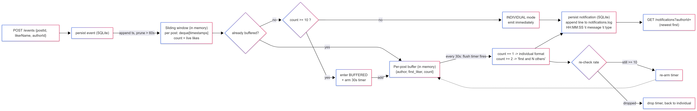

# Notification Batcher

At low volume, send one notification per like ("Chidi liked your post"). When a
post goes viral, group them ("Maria and 72 others liked your post"). This service
flips between the two modes automatically based on the **per-post like rate**,
measured with a **true sliding 60-second window**.

- **Stack:** Python 3.12 + FastAPI + Uvicorn + SQLite.
- **Durable** (SQLite): the saved events and notifications.
- **In memory:** the 60s sliding window and the per-post buffer (as the brief requires).

---

## Setup

```bash
cd notification_batcher
python3 -m venv .venv
source .venv/bin/activate
pip install -r requirements.txt

uvicorn main:app --reload --port 8000
```

Tunable via env vars (defaults match the brief):

| var | default | meaning |
|-----|---------|---------|
| `THRESHOLD` | `10` | likes/min at which a post switches to buffered/grouped |
| `WINDOW_SECONDS` | `60` | sliding window length |
| `FLUSH_SECONDS` | `30` | how often a buffered post flushes a grouped notification |
| `BATCHER_DB` | `batcher.db` | SQLite file |
| `NOTIFICATIONS_LOG` | `notifications.log` | the append-only notification log |

> For a short demo recording use smaller values, e.g.
> `THRESHOLD=5 WINDOW_SECONDS=8 FLUSH_SECONDS=3 uvicorn main:app --port 8000`.

### Endpoints (curl)

```bash
# POST /events -> saves the like, returns {eventId, mode: "individual"|"buffered"}
curl -s -X POST http://127.0.0.1:8000/events \
  -H 'Content-Type: application/json' \
  -d '{"postId":"p1","likerName":"Chidi","authorId":"author1"}'
# {"eventId":"...","mode":"individual"}

# GET /notifications?authorId= -> author's notifications, newest first
curl -s "http://127.0.0.1:8000/notifications?authorId=author1"
```

### One-command demo (individual -> grouped -> back)

```bash
./demo.sh            # uses a fast config so the whole arc is short
# or tune it:  PORT=8000 THRESHOLD=5 WINDOW_SECONDS=8 FLUSH_SECONDS=3 ./demo.sh
```

---

## Architecture



---

## Core concepts, in my own words

**Why batching matters.** A viral post can attract thousands of likes a minute.
Sending one push/email/row per like would hammer the notification pipeline,
spam the author, and turn a popularity spike into an outage. Batching collapses a
burst into a single "X and N others" message: fewer writes, fewer pushes, a
calmer system, and a better UX.

**When the mode flips.** Each post has a rolling 60s count of likes. When a like
pushes that count to **10 or more** (threshold evaluated *including* the
just-arrived like), the post enters buffered mode and arms a single 30s flush
timer. It stays buffered — incoming likes just join the buffer — until a flush
re-checks the rate. If the rate has dropped below 10/min, it returns to
individual mode and the timer is cleared. Deciding entry per-like but exit only at
flush is deliberate: it gives **hysteresis** so the system doesn't thrash on/off
right at the threshold.

**Sliding vs fixed window.** A *fixed* window counts likes in clock buckets
(e.g. 12:00:00–12:00:59) and resets to zero at the boundary. That lets bursts hide
across a boundary (9 likes at :59 + 9 at :00 never look busy) and causes sudden
resets. A *sliding* window always looks at "the last 60 seconds from right now":
every like records a timestamp, and timestamps older than 60s are dropped on each
check. The count reflects the true current rate at every instant, so the mode
flips at the right moment and decays smoothly as a burst ages out.

**The "and N others" / count==1 edge case.** A grouped message names the first
liker in the buffer and shows the buffer's total count: `"Maria and 72 others
liked your post"`. If a flush ever holds just **one** like, the grouped template
would read `"… and 1 others"` — wrong — so we fall back to the individual format
`"Maria liked your post"`. That guarantees `"and 1 others"` is never produced.

---

## notifications.log — the transition

`HH:MM:SS \t message \t type`, one line written immediately per notification
(individual → grouped → back to individual):

```
10:04:27	Ada liked your post	individual
10:04:27	Bola liked your post	individual
10:04:28	Chidi liked your post	individual
10:04:28	Dele liked your post	individual
10:04:31	Emeka and 5 others liked your post	grouped
10:04:40	Zoe liked your post	individual
```

---

## What I struggled with

- **Thrashing at the threshold.** My first version re-decided the mode on every
  like. Right around 10/min it flip-flopped, interleaving individual notifications
  with a pending buffer. Fix: once buffered, stay buffered until the flush
  re-evaluates (hysteresis).
- **Timer lifecycle.** I initially armed a new `threading.Timer` on every buffered
  like, ending up with many timers per post firing repeatedly. Fix: keep exactly
  one timer per post in a dict; the flush either re-arms one (still hot) or clears
  it (cooled down).
- **The "and 1 others" trap.** Caught by the edge case — a flush that ends up with
  a single buffered like must use the individual wording.
- **Threads + SQLite.** The flush fires on a worker thread, so I needed
  `check_same_thread=False` plus a lock to serialize DB access, and an `RLock`
  guarding the in-memory window/buffer/timer maps.
- **Testing time-based logic.** 60s windows and 30s timers are painful to test for
  real. I injected a fake clock for the window and used a tiny flush interval, so
  the whole individual→grouped→back arc is verified in well under a second.

## What I learned

- The difference between fixed and sliding windows and why it matters for rate
  limiting and burst detection.
- Hysteresis as a pattern for stable mode-switching near a threshold.
- Coordinating background timers with shared mutable state safely (locks, single
  timer per key, clean shutdown).
- Making time-dependent code testable by injecting the clock.

## Resources I consulted

- Sliding window rate limiting — Cloudflare blog & various write-ups
- Python docs — `threading.Timer`: https://docs.python.org/3/library/threading.html#timer-objects
- Python docs — `collections.deque`: https://docs.python.org/3/library/collections.html#collections.deque
- Python docs — `sqlite3` threading notes: https://docs.python.org/3/library/sqlite3.html
- FastAPI docs — request bodies & query params: https://fastapi.tiangolo.com/

## Why this made me a better backend developer

I can now design a system that adapts its behaviour to load instead of doing the
same thing at 1 like/min and 10,000 likes/min. I understand sliding-window rate
detection well enough to implement it correctly (not the fixed-bucket
approximation), and I know how to keep a mode-switch stable with hysteresis so it
doesn't thrash. I'm comfortable running background timers against shared state
without races, and I learned to make time-based logic testable by injecting the
clock. In production I'll now think about fan-out amplification, how bursts hide
in fixed windows, and the lifecycle of every background timer I create.

---

## Tests

```bash
python test_service.py
```

Covers: exact log format, newest-first listing, the full individual → grouped →
back-to-individual arc, one-timer-per-post, and the single-like flush fallback
(never `"and 1 others"`).
